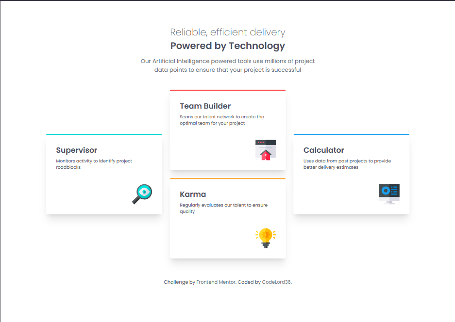
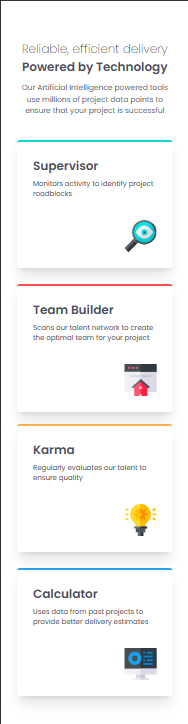

# 💡 Four Card Feature Section

A responsive four-card feature section built with **React, TypeScript, Vite, and Tailwind CSS**.

This project recreates a clean and modern feature showcase interface with a responsive four-card layout highlighting **Supervisor, Team Builder, Karma, and Calculator** features.

The project focuses on **responsive frontend development, component-based architecture, TypeScript data modeling, CSS Grid layouts, utility-first styling, and maintainable React project structure**.

---

## 🌐 Live Demo

🚀 **[View Live Website](https://four-card-feature-section-pied-three.vercel.app/)**

The project is deployed on **Vercel** and is available online for viewing and testing.

---

## 📸 Preview

### Desktop



### Mobile



---

## ✨ Features

- 📱 Responsive design for mobile and desktop screens
- 🧩 Component-based React architecture
- 🎨 Utility-first styling with Tailwind CSS
- 🃏 Reusable feature card component
- 🧱 Responsive CSS Grid layout
- 📊 Data-driven feature cards
- 🎯 Typed feature and accent-color definitions
- 🎨 Custom color system using Tailwind CSS theme variables
- 🔤 Custom Poppins typography
- ♿ Semantic HTML structure
- 📐 Design-focused responsive layout
- 🗂️ Organized components, data, and type definitions
- ⚡ Fast development workflow with Vite
- 🚀 Production deployment with Vercel

---

## 🛠️ Technologies

| Technology       | Purpose                              |
| ---------------- | ------------------------------------ |
| **React**        | Building the user interface          |
| **TypeScript**   | Static typing and safer development  |
| **Vite**         | Development server and build tooling |
| **Tailwind CSS** | Utility-first responsive styling     |
| **Poppins**      | Typography and visual hierarchy      |
| **ESLint**       | Code quality and linting             |
| **Vercel**       | Production deployment                |

The project currently uses **React 19, TypeScript 6, Vite 8, and Tailwind CSS 4**.

---

## 🧱 Component Architecture

The application is divided into focused React components instead of placing the entire interface inside one component.

```text
App

│

├── Header

│

├── FeatureGrid

│   │

│   └── FeatureCard

│

└── Footer
```

The main `App` component composes the `Header`, `FeatureGrid`, and `Footer` components. The `FeatureGrid` then handles the collection of reusable `FeatureCard` components.

This approach keeps the code easier to understand, maintain, and extend as the application grows.

---

## 📁 Project Structure

```text
four-card-feature-section/

│

├── public/

│

├── src/

│   │

│   ├── components/

│   │   ├── FeatureCard.tsx

│   │   ├── FeatureGrid.tsx

│   │   ├── Footer.tsx

│   │   └── Header.tsx

│   │

│   ├── data/

│   │   └── features.ts

│   │

│   ├── types/

│   │   └── feature.ts

│   │

│   ├── App.tsx

│   ├── index.css

│   └── main.tsx

│

├── index.html

├── eslint.config.js

├── package.json

├── package-lock.json

├── style-guide.md

├── tsconfig.json

├── tsconfig.app.json

├── tsconfig.node.json

├── vite.config.ts

└── README.md
```

The repository separates the main application, reusable components, feature data, type definitions, and global styling into dedicated areas.

---

## 🎨 Styling Approach

The project uses **Tailwind CSS** to handle the visual styling, responsive layout, typography, spacing, and component presentation.

Tailwind CSS is integrated directly through the Vite plugin and the project's global `index.css` file.

The styling approach focuses on:

- **Utility classes** — reusable Tailwind utilities for layout and visual styling
- **Responsive utilities** — adapting the interface across viewport sizes
- **CSS Grid** — positioning the feature cards into the required desktop arrangement
- **Theme variables** — maintaining consistent colors and typography
- **Component-level styling** — keeping styling close to the components they control
- **Custom typography** — integrating the Poppins font family

The project defines custom theme values for the four feature-card accent colors, including red, cyan, orange, and blue.

---

## 🎨 Design System

The implementation follows the provided Frontend Mentor style guide and uses a custom Tailwind theme for the primary visual tokens.

### Feature Colors

| Feature          | Color                |
| ---------------- | -------------------- |
| **Supervisor**   | `hsl(180, 62%, 55%)` |
| **Team Builder** | `hsl(0, 78%, 62%)`   |
| **Karma**        | `hsl(34, 97%, 64%)`  |
| **Calculator**   | `hsl(212, 86%, 64%)` |

### Neutral Colors

| Color        | Value                |
| ------------ | -------------------- |
| **Grey 500** | `hsl(234, 12%, 34%)` |
| **Grey 400** | `hsl(212, 6%, 44%)`  |
| **White**    | `hsl(0, 0%, 100%)`   |

### Typography

**Poppins**

- 200
- 400
- 600

The Poppins font is imported and registered as the project's custom Tailwind font family.

---

## 🧩 Data-Driven Feature Cards

Instead of hardcoding each feature card directly inside the layout, the project uses a dedicated feature-data structure.

Each feature can contain properties such as:

- Feature title
- Description
- Icon
- Accent color
- Layout position

This allows the `FeatureGrid` and `FeatureCard` components to work with structured data rather than repeating the same markup for every card.

This approach makes the feature section easier to maintain and provides a foundation for adding or modifying cards without significantly changing the component structure.

---

## 📱 Responsive Design

The interface was designed to work across different viewport sizes, with particular attention to:

- Mobile layouts
- Desktop layouts
- CSS Grid positioning
- Card sizing
- Typography
- Content spacing
- Feature-card alignment
- Icon positioning
- Container sizing
- Readability across screen sizes

The original challenge provides reference layouts for different viewport sizes, and the implementation adapts the card arrangement as the available screen width changes.

The goal was to preserve the visual hierarchy and overall design while adapting the feature grid to smaller screens.

---

## 🚀 Getting Started

### Prerequisites

Make sure you have the following installed:

- [Node.js](https://nodejs.org/)
- npm

### 1. Clone the repository

```bash
git clone https://github.com/CodeLord36/four-card-feature-section.git
```

### 2. Navigate into the project

```bash
cd four-card-feature-section
```

### 3. Install dependencies

```bash
npm install
```

### 4. Start the development server

```bash
npm run dev
```

Vite will start the development server and provide a local URL for the application.

---

## 📦 Available Scripts

### Development

```bash
npm run dev
```

Starts the Vite development server.

### Production Build

```bash
npm run build
```

Runs TypeScript compilation and creates an optimized production build.

### Preview Production Build

```bash
npm run preview
```

Runs the production build locally for previewing.

### Lint

```bash
npm run lint
```

Runs ESLint against the project.

These scripts are defined in the project's `package.json`.

---

## 🧠 What I Learned

Building this project helped me strengthen several frontend development concepts.

### React

I practiced breaking a complete interface into smaller, focused React components rather than building the entire page inside one component.

### TypeScript

I continued working with TypeScript in a React environment and practiced creating typed structures for feature data and component properties.

### Tailwind CSS

I improved my understanding of Tailwind CSS and how utility classes can be combined to create responsive layouts without relying on traditional CSS or SCSS architecture.

I practiced working with:

- Responsive utilities
- CSS Grid
- Flexbox
- Typography
- Spacing
- Colors
- Sizing
- Shadows
- Custom theme variables

### CSS Grid

This project gave me practical experience using **CSS Grid** to create a multi-card layout where the cards need to maintain a specific visual arrangement across desktop screens.

### Data-Driven Components

I learned how separating content from presentation can make React components more reusable.

Rather than creating four completely independent cards, the project uses structured feature data that can be passed into reusable components.

### Component Architecture

I learned that even a relatively small interface benefits from separating independent sections into focused components.

### Responsive Design

I improved my understanding of how a desktop grid layout needs to transition into a mobile-friendly layout instead of simply shrinking the desktop version.

### Development Workflow

I also practiced the complete frontend workflow:

```text
Design

   ↓

Component Planning

   ↓

Type & Data Modeling

   ↓

React Development

   ↓

Tailwind CSS Styling

   ↓

CSS Grid Layout

   ↓

Responsive Testing

   ↓

Linting

   ↓

Production Build

   ↓

Vercel Deployment
```

---

## 📚 Project Inspiration

This project was built as a frontend practice project based on the **Four Card Feature Section** challenge from Frontend Mentor.

Frontend Mentor challenges provide realistic interface designs that help developers practice translating visual designs into functional frontend implementations.

The focus of this project was not only on reproducing the visual design, but also on practicing:

- React component architecture
- TypeScript
- Tailwind CSS
- CSS Grid
- Responsive design
- Data-driven components
- Frontend project structure
- Typography
- Production deployment

---

## 📌 Project Status

**Completed ✅**

The current version successfully implements the four-card feature section with a responsive React component architecture and Tailwind CSS styling.

The project is deployed to Vercel and can be viewed online.

Future development can focus on introducing additional interactions, improving accessibility, adding animations, and making the feature-card system even more reusable.

---

## 👨‍💻 Author

### CodeLord36

Frontend developer building projects with modern web technologies and continuously improving software engineering skills.

**GitHub:**

[github.com/CodeLord36](https://github.com/CodeLord36)

**Project Repository:**

[github.com/CodeLord36/four-card-feature-section](https://github.com/CodeLord36/four-card-feature-section)

**Live Demo:**

[four-card-feature-section-pied-three.vercel.app](https://four-card-feature-section-pied-three.vercel.app/)

---

## ⭐ Acknowledgements

Thanks to the **Frontend Mentor** community and the design resources that provided the inspiration and specifications for this project.

---

### Built using React, TypeScript, Vite & Tailwind CSS
